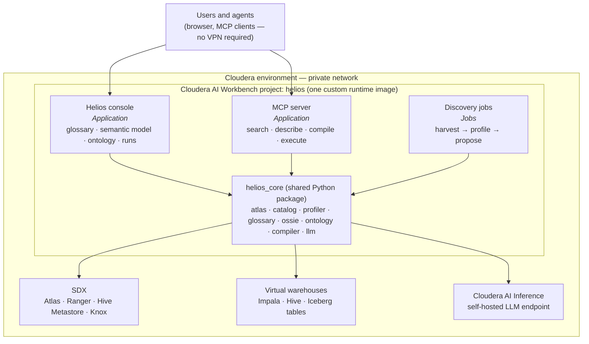

# helios

**Connect it to your Cloudera data lake and it helps your users speak to their data.**

helios is an engine that runs inside Cloudera AI Workbench, inspects an existing Cloudera lakehouse — whatever engine fronts it: Impala, Hive, Spark — and generates the layers of meaning that sit between raw tables and a human (or agent) asking a question in plain language:

1. **A business glossary** in Apache Atlas — what the data is called and what it means.
2. **A semantic layer** in the Apache Ossie format — how tables join, which columns are measures and dimensions, and how metrics are defined.
3. **An ontology** — the concepts, relationships and rules of the business domain that the glossary and semantic layer describe.

Each layer is *proposed* by helios from evidence in the warehouse, then *reviewed and published* by a human through the helios console. Published layers are exposed to agents and applications through an MCP server, so any agentic flow can ask "what does net paid mean", "how do I get sales by store for last quarter", or "which customers returned more than average" and get a governed answer instead of guessing at SQL.

Everything runs self-hosted: the models, the runtime, the applications.

---

## Why

Text-to-SQL against a bare warehouse fails for predictable reasons: the model doesn't know that `ss_net_paid` is revenue, that `store_sales` joins to `date_dim` on the sold date rather than the ship date, or that "gross margin" excludes returns. Those facts exist — in people's heads, in BI tools, in old query logs — but not anywhere a machine can read them. helios extracts and structures them so that "speaking to your data" becomes a lookup against a governed model rather than a guess.

The glossary, semantic layer and ontology are three views of the same knowledge at different levels of formality. helios treats them as one project: generated together, reviewed together, versioned together.

## Design principles

| Principle | What it means in practice |
|-----------|---------------------------|
| **Propose, don't decide.** | helios drafts every artifact with a confidence score and a rationale. Nothing is published without a human accepting it. |
| **Evidence first, LLM second.** | Deterministic analysis (naming conventions, key-overlap statistics, query history) does most of the work. A self-hosted LLM handles judgement: names, descriptions, ambiguous joins, metric candidates, concept mapping. |
| **Open formats.** | Glossary lives in Atlas. Semantic layer is Ossie JSON/YAML. Ontology will use an open, tool-readable format (see below). No helios-proprietary model is the source of truth. |
| **Engine-agnostic.** | helios reads the shared Hive Metastore and works on Iceberg tables, so it sees the same catalog regardless of which engine a user queries with. Generated SQL is built as a canonical AST and transpiled per engine with SQLGlot. Impala is the first engine implemented because it is the interactive engine in the development environment; Hive and Spark follow through the same adapter interface. |
| **Self-hosted.** | LLM calls go to Cloudera AI Inference. All components run as Jobs and Applications in one Cloudera AI Workbench project on a custom runtime. |
| **Governed.** | Ranger applies to every query helios executes; Atlas attributes every glossary change; the MCP server is not a bypass. |

---

## The three layers

### 1. Business glossary (Atlas)

Terms, definitions, valid values, abbreviations and relationships between terms, stored as an Atlas glossary and linked to the physical columns they describe. helios can:

- generate an initial glossary from column names, types, profiled values and query usage;
- seed from an existing glossary, BI definitions or documentation the user supplies;
- manage the glossary through the console (create, read, update, delete, bulk import, term-to-column assignment) without the user needing network access to Atlas.

### 2. Semantic layer (Apache Ossie)

[Apache Ossie](https://github.com/apache/ossie) (formerly Open Semantic Interchange) is an Apache Incubator project that defines a JSON/YAML specification for semantic models: datasets, dimensions, measures, metrics, relationships and an ontology hook. It ships a schema, a validator, converters (dbt, GoodData, Polaris, Salesforce) and example models, including a full TPC-DS model.

Ossie is a **format, not an engine** — nothing in the project executes a semantic query against Impala or Hive. helios provides the two things Ossie does not:

- a **discovery pipeline** that produces an Ossie model from a live Cloudera warehouse;
- a **compiler** that turns a semantic request (metrics + dimensions + filters) into SQL for the target engine, using the Ossie model as the join graph.

Ossie was chosen because it is vendor-neutral and can be read by other tools; helios models can be handed to any Ossie-aware consumer.

### 3. Ontology

The ontology layer is in design. Its role is to capture what the glossary and semantic layer cannot: the concepts of the domain (Customer, Order, Return, Channel), how they relate (a Return *reverses part of* an Order; a Store *belongs to* a Market), business rules ("net sales after returns excludes store credit"), and synonyms and hierarchies that let a question phrased in one vocabulary resolve to the right terms and metrics. It is the layer a question-answering agent consults first, before it touches the semantic model.

Open questions being worked through:

- representation — Ossie's ontology section, a lightweight OWL/SKOS graph, or both, with Atlas as the store;
- how much can be inferred from the glossary and semantic layer versus authored;
- how the ontology is versioned and reviewed alongside the other two layers.

---

## Conceptual architecture

Users and agents only reach the Workbench's public endpoint. Every call to Atlas, the virtual warehouses or the inference service is made from inside the Cloudera environment's private network by helios components — which is why the console works without a VPN.



### Components

**Discovery jobs** — Workbench Jobs chained by dependency, each writing its output to the project filesystem so a failed stage can be rerun alone.

| Job | Reads | Produces |
|-----|-------|----------|
| `harvest` | HMS (tables, columns, types, partitions, Iceberg schema), Atlas (existing glossary, classifications, lineage), query history from whichever engines are configured | `harvest.json` — the raw catalog snapshot |
| `profile` | Sampled statistics run through a configured engine: cardinality, null rate, min/max, value overlap between candidate key pairs | `profile.json` — evidence for relationships, typing and valid values |
| `propose` | `harvest.json` + `profile.json` + the LLM | Draft glossary terms, a draft Ossie model, and draft ontology concepts — each element with confidence and rationale |

**Helios console** — a Workbench Application (FastAPI backend, lightweight frontend) behind Workbench SSO. Modules:

- *Glossary* — Atlas glossary CRUD, bulk import, term-to-column assignment, term ↔ column browsing.
- *Semantic model* — diff a proposed Ossie model against the published one; accept, reject or edit each element; publish.
- *Ontology* — review proposed concepts and relationships; author rules; publish.
- *Runs* — trigger discovery jobs and read their logs through the Workbench API v2.
- *Health* — connectivity checks for Atlas, each configured engine and the inference endpoint.

**MCP server** — a second Workbench Application, separate from the console because it has different consumers and different authentication (bearer tokens for agents rather than browser SSO). Tools:

| Tool | Purpose |
|------|---------|
| `search_semantics(question)` | Resolve a natural-language question to relevant concepts, terms, metrics and dimensions |
| `describe(entity)` | Definition, formula, lineage, glossary and ontology context for one thing |
| `list_models` / `describe_model` | What published models exist and what they contain |
| `compile_query(metrics, dimensions, filters, engine)` | Generate SQL for the requested engine from a semantic request |
| `run_query(...)` | Compile and execute, returning rows |
| `explain_lineage(entity)` | Atlas lineage for the underlying columns |

**`helios_core`** — the shared library every workload imports. Jobs and Applications are thin entry points; all logic lives here.

| Package | Responsibility |
|---------|----------------|
| `helios_core.atlas` | Atlas REST client: glossary CRUD, term assignment, entity search, lineage |
| `helios_core.catalog` | HMS metadata: databases, tables, columns, partitions |
| `helios_core.engines` | Engine adapters (Impala first; Hive, Spark next): connection, query execution, query-history extraction, dialect name for the compiler |
| `helios_core.profiler` | Sampling queries and statistics used as evidence |
| `helios_core.glossary` | Glossary generation and CSV import/export |
| `helios_core.ossie` | Build, validate (against `osi-schema.json`), diff and version Ossie models |
| `helios_core.ontology` | Ontology model, inference from the other layers, serialization |
| `helios_core.compiler` | Ossie model → join graph → canonical SQL AST → engine dialect via SQLGlot; engine-specific quirks live in the adapter, not here |
| `helios_core.llm` | Client for Cloudera AI Inference with schema-constrained structured output |

### State

- **Glossary** lives in Atlas; helios reads and writes it but does not duplicate it.
- **Semantic models and ontologies** live in git: `models/proposed/` for drafts, `models/published/` for the current governed versions. Versioning is by commit.
- **Run history and profiling statistics** are Iceberg tables in a `helios_meta` database in the warehouse, so the engine's own history is queryable through the same engines it serves.

### Runtime

A single custom runtime image built from `runtime/Dockerfile` on Cloudera's PBJ Workbench Python 3.12 base (`ml-runtime-pbj-workbench-python3.12-standard:2026.08.1-b5`). It contains dependencies only (Ossie tooling, SQLGlot, impyla/pyhive, MCP SDK, FastAPI, requests); the code comes from the project's git checkout. A code change is a `git pull`; a dependency change is a rebuild. The image is published to Docker Hub as `docker.io/christopheraburns/helios-runtime:<version>` (current: `docker.io/christopheraburns/helios-runtime:0.1.1`) and registered in Cloudera AI via Runtime Catalog → Add Runtime.

To build and push a new version from `runtime/` (Docker Desktop; WSL2 or PowerShell):

```bash
./build.sh christopheraburns 0.1.2        # WSL2
.\build.ps1 -User christopheraburns -Version 0.1.2   # PowerShell
```

Each re-registered version must bump `ML_RUNTIME_MAINTENANCE_VERSION` and `ML_RUNTIME_FULL_VERSION` in the Dockerfile to match the image tag.

### Identity and governance

Workbench Applications and Jobs run as the identity that created them, not the caller. Consequences:

- Atlas attributes every glossary change to the console's identity; the console keeps its own audit trail of the acting user.
- The MCP server executes queries either with the calling agent's workload credentials passed through, or with a deliberately scoped service account. This is decided before the MCP server is exposed beyond the demo.

### Engine support

| Engine | Status | Notes |
|--------|--------|-------|
| Impala | First target | Interactive latency suits agent workloads; richest query-profile history for metric mining |
| Hive | Planned | Same catalog and tables; validates the SQLGlot dialect switch and covers ACID tables |
| Spark SQL | Planned | For notebook and pipeline consumers of the same semantic model |

Adding an engine means implementing one adapter (connect, execute, fetch query history, name the SQLGlot dialect) and adding its connection to the project configuration. Nothing in discovery, review or the MCP tools is engine-specific.

---

## Repository layout

```
helios/
├── README.md
├── runtime/            Dockerfile, requirements.txt — the custom Workbench runtime
├── helios_core/        shared library (see table above)
├── jobs/               harvest.py, profile.py, propose.py — Workbench Job entry points
├── apps/
│   ├── console/        Helios console application (FastAPI + static frontend)
│   └── mcp/            MCP server application
├── models/
│   ├── proposed/       drafts written by discovery runs (semantic models, ontologies)
│   └── published/      the current governed versions
├── setup/              scripts that build the sample environment (see below)
└── Atlas_Glossary/     TPC-DS glossary generator and Atlas loader (see below)
```

---

## Sample environment

helios is developed against a TPC-DS warehouse in a Cloudera public cloud environment.

**Platform services in use:** SDX data lake (Hive Metastore, Atlas, Ranger, Knox), one Impala Virtual Warehouse in Cloudera Data Warehouse, Cloudera AI Workbench, Cloudera AI Inference, S3 data lake storage.

**Data:** TPC-DS at scale factor 1 (~1 GB, 24 tables), generated with DuckDB's `tpcds` extension, landed as Parquet in the data lake bucket, staged as external tables and converted to Iceberg tables in the Impala database `tpcds`.

```
setup/start.py       generate TPC-DS Parquet with DuckDB (run in a Workbench session)
setup/gen_ddl.py     emit stage.sql and iceberg.sql from the generated table directories
setup/stage.sql      CREATE EXTERNAL TABLE ... LIKE PARQUET for each table (database tpcds_stage)
setup/iceberg.sql    CREATE TABLE ... STORED AS ICEBERG AS SELECT ... (database tpcds), COMPUTE STATS
```

A handful of TPC-DS benchmark queries (Impala dialect, from `cloudera/impala-tpcds-kit`) are run against the warehouse so that Impala query history contains realistic aggregation patterns for discovery to mine. Literal filter values in the kit's queries were generated for a 10 TB scale factor and may need adjusting at SF1.

**Business glossary:** an Atlas glossary named `TPCDS Retail` with 138 terms (entities, measures with dsdgen pricing formulas, dimension attributes and derived KPIs) linked to 393 columns. This is the *reference* glossary — what helios should be able to approximate from a cold start.

```
Atlas_Glossary/build_glossary.py        generates the glossary CSVs from a term catalogue in code
Atlas_Glossary/assign_terms.py          imports a glossary CSV into Atlas and links terms to columns
Atlas_Glossary/tpcds_glossary_full.csv  all 138 terms, Atlas bulk-import format
Atlas_Glossary/tpcds_glossary_seed.csv  32 core terms — the "cold start" glossary for discovery experiments
Atlas_Glossary/tpcds_term_columns.csv   term → table.column assignments
```

Usage (from a machine that can reach the data lake gateway, or from a Workbench session):

```bash
export ATLAS_BASE="https://<datalake-host>/<datalake-name>/cdp-proxy-api/atlas/api/atlas/v2"
export ATLAS_USER=<workload-username>
export ATLAS_PASS='<workload-password>'
python3 assign_terms.py tpcds_glossary_full.csv                # import + assign
python3 assign_terms.py tpcds_glossary_full.csv --skip-import  # glossary already loaded; only assign
```

Two things worth knowing about Atlas glossary import in this environment: the REST import returns `409` if any term already exists (it does not update in place — delete the glossary and reload to change definitions), and the `Synonyms` column is a term-to-term relationship rather than free text, so synonyms are folded into each term's long description.

**Why two glossaries.** The full glossary is what a well-governed warehouse would have. Loading it before a discovery run hands the engine the answer key. For evaluation, the seed glossary is loaded under a separate name and the full one is hidden; the gap between the seed terms and the full set is what helios is expected to close.

---

## Evaluation

Each generated layer is scored against a reference:

| Layer | Reference | Measure |
|-------|-----------|---------|
| Glossary | `TPCDS Retail` full glossary | Terms recovered, definitions judged correct, column links correct |
| Semantic layer | The Ossie TPC-DS example model from the Ossie repository | Relationships found and missed, metrics proposed, naming quality |
| Question answering | The TPC-DS query set | Fraction of benchmark questions that can be expressed as a semantic request and compiled to correct SQL on each supported engine. Queries that cannot (e.g. correlated subqueries comparing each customer to 1.2× a store average) mark where the semantic layer hands off to raw SQL |

A second, less canonical dataset (Wide World Importers or the Olist e-commerce set) will be added to test discovery on schemas without TPC-DS's textbook naming conventions. A Hive Virtual Warehouse on the same catalog will be added to prove that the published model serves more than one engine unchanged.

---

## Build order

1. **Runtime** — nothing else can be tested in-Workbench without it.
2. **Console with the glossary module** — proves the application pattern, the server-side Atlas proxy and the public endpoint; immediately useful.
   The Impala engine adapter is built alongside it, since the health module needs it.
3. **Discovery jobs** — harvest and profile first (deterministic), then propose (LLM), initially for glossary and semantic model.
4. **Review modules in the console** — diff, accept/reject, publish for each layer.
5. **MCP server** — depends on a published semantic model.
   Then the Hive adapter, to demonstrate engine independence end to end.
6. **Ontology** — design finalized once the first two layers are producing real output to build on.

## Open decisions

- Which model to serve on Cloudera AI Inference for `propose` (affects how much structured-output constraining is needed).
- Ontology representation and store (see above).
- Whether the MCP server passes caller identity through to Impala or uses a scoped service account.
- Whether the console and MCP server merge into a single Application once both exist.
- Which Ossie spec version to pin; the spec is pre-1.0 and converters disagree on accepted versions.

## References

- Apache Ossie — https://github.com/apache/ossie
- Ossie DuckDB reference runtime (design pattern for the Impala/Hive compiler)
- Apache Atlas glossary REST API
- Cloudera Impala TPC-DS kit — https://github.com/cloudera/impala-tpcds-kit
- TPC-DS specification — http://www.tpc.org/tpcds/
