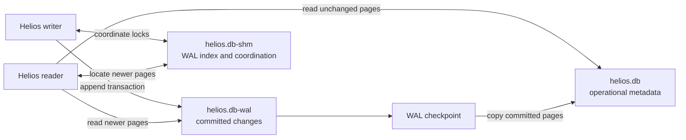
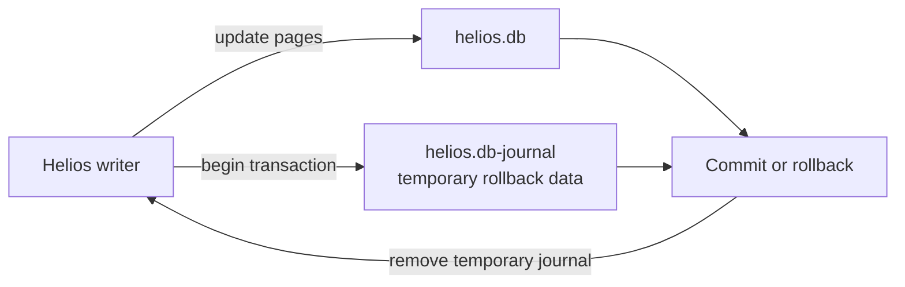

# Helios operational metadata database

Helios stores its application state in an SQLite database named
`state/helios.db` under `HELIOS_ROOT`. The location can be overridden with
`HELIOS_METADATA_DB`.

This is the Helios operational metadata database. It is not the Data Lake and
does not contain the business data queried through Impala or stored in Iceberg.

## What `helios.db` stores

The database contains application state such as:

- organizations and Principals;
- organization memberships and Model grants;
- Model and DataSource registrations;
- model-to-DataSource associations;
- persisted conversations and messages;
- conversation trace runs and structured agent/MCP spans;
- model evaluation runs, per-question results, and aggregate metrics;
- audit and activity events;
- schema migration history.

Discovery outputs, profiles, semantic artifacts, and ontology artifacts remain
in their respective `runs/` and `models/` locations. Atlas remains authoritative
for Atlas-managed glossary content. Credentials and tokens belong in Cloudera
environment or secret configuration and must not be stored in `helios.db`.

Trace records include sanitized LLM/tool payloads, latency, token counts,
termination reasons, model and prompt versions, and client/server correlation.
Secret-like fields are redacted and large values are truncated before they
reach SQLite. Evaluation rows reference their trace runs instead of duplicating
full step payloads.

SQLite is appropriate for the current single-API-process evaluation runner,
but increasing CPU and memory does not change SQLite's one-writer concurrency
model. Do not run multiple API replicas or concurrent evaluation workers
against this file. Before introducing resumable workers or horizontal scaling,
move operational metadata to a shared transactional service and use a durable
job queue.

## SQLite journal files

SQLite uses journal files to make transactions atomic and recoverable. The
files that appear beside `helios.db` depend on the configured journal mode.

### Write-Ahead Log

`helios.db-wal` is the SQLite Write-Ahead Log. In WAL mode, committed database
changes are appended to this file before they are copied into `helios.db`.
Readers can continue reading the main database while another process writes.

A WAL file can therefore contain committed changes that are not yet present in
the main database file. It must not be deleted manually.

### Shared-memory file

`helios.db-shm` is SQLite's shared-memory coordination file for WAL mode. It
contains:

- an index of database pages currently stored in the WAL;
- reader and writer coordination state;
- lock information used by SQLite processes.

It contains no independent Helios application data and is meaningful only
alongside the matching database and WAL files.

### WAL checkpoints

A checkpoint copies committed pages from the WAL into the main database:

```text
helios.db-wal -> helios.db
```

After a successful truncating checkpoint, the WAL becomes empty or disappears.
The SHM file normally disappears after the final WAL connection closes.



## DELETE journal mode

Helios defaults to SQLite `DELETE` journal mode. During a write transaction,
SQLite temporarily creates:

```text
helios.db-journal
```

The rollback journal holds enough previous page content to undo an incomplete
transaction. SQLite removes it after a successful commit or rollback.



`DELETE` mode avoids persistent WAL shared-memory coordination and is safer for
the shared Cloudera project filesystem. Set
`HELIOS_SQLITE_JOURNAL_MODE=WAL` only for a verified single-host deployment.
SQLite remains interim storage and should not be used for horizontally scaled
Helios instances or high write concurrency. A transactional shared database is
required before that deployment model is supported.

## Understanding database locks

SQLite uses operating-system file locks to prevent processes from changing the
same database structures incompatibly. A `database is locked` error can occur
when:

- another API, MCP, Session, or Job has an active transaction;
- one process is using WAL while another tries to change journal mode;
- a process stopped unexpectedly and WAL coordination has not been cleaned up;
- the shared filesystem does not provide the locking behavior SQLite expects.

For example, Helios cannot change an existing database from WAL to DELETE mode
while another process has it open in WAL mode. The journal-mode change waits for
the configured timeout and then raises:

```text
sqlite3.OperationalError: database is locked
```

The lock protects the database from an unsafe mode transition. It does not
indicate that Impala, Iceberg, or Data Lake data is locked.

## Safe restart order

When changing SQLite journal mode or repairing metadata:

1. Stop the Helios UI, MCP, and API Applications.
2. Stop all Helios Jobs that may access operational metadata.
3. Wait until the workloads have fully stopped.
4. Start the API Application first so it can validate and migrate the schema.
5. Confirm API readiness.
6. Start the MCP Application.
7. Start the UI Application.

The UI does not open SQLite directly, but stopping it avoids user requests
during maintenance.

## Integrity and recovery

The API and MCP readiness endpoints perform a read-only SQLite quick check.
They return HTTP 503 when metadata integrity is unavailable rather than
silently deleting or recreating the database.

Run explicit checks from a Workbench Session:

```bash
cd "$CDSW_PROJECT_DIR/helios"
python - <<'PY'
from helios_core.metadata import SQLiteMetadataRepository

repository = SQLiteMetadataRepository()
print(repository.path)
print("quick:", repository.integrity_check())
print("full:", repository.integrity_check(thorough=True))
PY
```

Helios provides backup-first repair tooling:

```bash
python -m helios_core.metadata.repair \
  --rebuild-index audit_events_principal_session_time_idx
```

If a damaged b-tree prevents index rebuilding:

```bash
python -m helios_core.metadata.repair --recover
```

Repair must be performed only after all metadata users stop. The tooling:

1. refuses to proceed with a non-empty active WAL;
2. creates a timestamped backup under `state/backups/`;
3. repairs or logically recovers into a clean SQLite database;
4. runs quick and full integrity checks;
5. replaces the original only after successful recovery validation.

Never delete `helios.db`, `helios.db-wal`, `helios.db-shm`, or
`helios.db-journal` as a troubleshooting shortcut. In particular, a WAL can
contain committed metadata that has not yet been checkpointed into the main
database.
