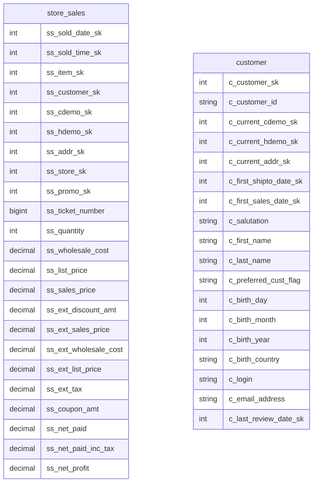
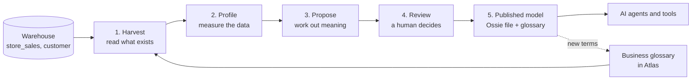
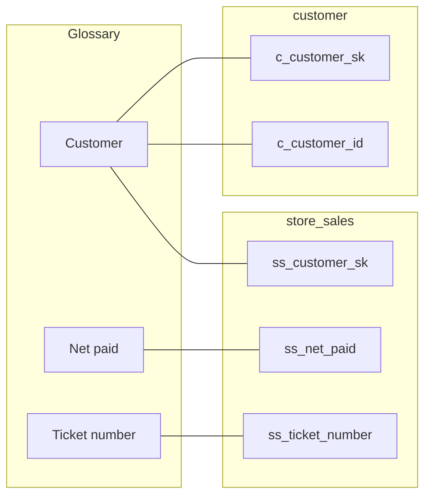
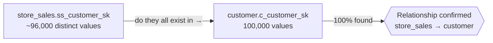
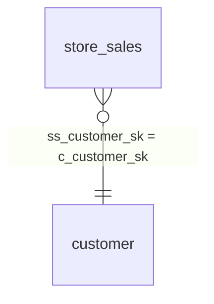
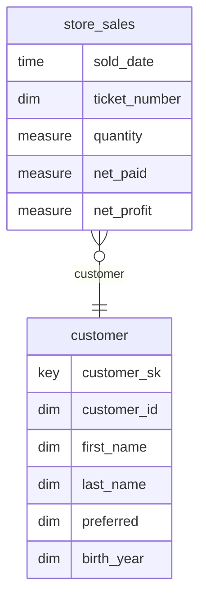

# helios, end to end, with two tables

*A walkthrough for people who have never heard of helios, semantic layers, ontologies, or Ossie.*

---

## The problem helios solves

Imagine a retailer's data warehouse. Somewhere in it is the answer to a simple question:

> **"Which customers spent the most in our stores last year?"**

The answer exists. But to get it, someone has to know that store purchases live in a table called `store_sales`, that the amount a customer paid is in a column called `ss_net_paid` (not `ss_sales_price`, not `ss_ext_sales_price`, not `ss_net_paid_inc_tax` — all of which exist), that the customer's name is in a different table called `customer`, and that the two tables connect through a pair of columns named `ss_customer_sk` and `c_customer_sk`.

None of that is written down anywhere a computer can read. It's in people's heads, in old reports, in query history. When a person asks the question in plain English — to a colleague, or to an AI assistant — that knowledge is what's missing.

**helios reads the warehouse, works out what things mean, and writes the meaning down in formats that both people and AI agents can use.** A human checks its work before anything is published.

This document follows two tables through the whole process.

---

## The two tables

We'll use two tables from a standard retail sample warehouse (TPC-DS):

- **`store_sales`** — one row per item sold in a store. About 2.9 million rows.
- **`customer`** — one row per customer. 100,000 rows.

Here they are, as the warehouse sees them. The names are typical of real warehouses: terse, prefixed, and unexplained.



Notice what the warehouse does **not** tell you:

- There is no line connecting the two tables. The database doesn't record that `ss_customer_sk` refers to `c_customer_sk`.
- Nothing says which of the nine money columns in `store_sales` is "what the customer paid".
- Nothing says that `_sk` means a system-generated key you should never show to a person, or that `c_customer_id` is the identifier a person *would* recognise.

Everything below is about filling those gaps.

---

## The lifecycle at a glance



Steps 1–3 are automatic jobs. Step 4 is a person. Step 5 is the output that everything else consumes.

---

## Before helios: the business glossary

A **business glossary** is a dictionary of the words a business uses, with definitions, kept in a governance tool (here, Apache Atlas). Each term can be *linked* to the physical columns that hold that thing.

Most organisations have a partial glossary at best. In our sample, a few terms already exist and are linked:

| Term | Definition | Linked to |
|------|------------|-----------|
| **Customer** | A person who has purchased from any channel. | `customer.c_customer_sk`, `customer.c_customer_id`, `store_sales.ss_customer_sk` |
| **Net paid** | Extended sales price minus coupon amount. Revenue the customer actually paid, before tax. | `store_sales.ss_net_paid` |
| **Ticket number** | Identifier of a store receipt; groups the items bought in one visit. | `store_sales.ss_ticket_number` |
| **Surrogate key** | System-generated integer used to join tables. Never meaningful to the business. | every `_sk` column |



helios treats whatever glossary exists as *trusted human input*. Where a term is linked to a column, helios uses that definition rather than inventing one. Where no term exists — most of the 41 columns in our two tables — helios will propose one.

---

## Step 1 — Harvest: read what exists

Harvest is a job that takes a snapshot of everything helios can learn *without looking at the data itself*:

- the tables and their columns and types (from the catalog);
- how many rows each table has;
- the glossary terms and which columns they're linked to;
- a sample of SQL queries people have run recently.

For our two tables the snapshot looks like this (abbreviated):

```json
{
  "tables": [
    {"database": "tpcds", "table": "store_sales", "row_count": 2880404,
     "columns": [{"name": "ss_sold_date_sk", "type": "int"}, {"name": "ss_customer_sk", "type": "int"},
                 {"name": "ss_net_paid", "type": "decimal(7,2)"}, "... 20 more"]},
    {"database": "tpcds", "table": "customer", "row_count": 100000,
     "columns": [{"name": "c_customer_sk", "type": "int"}, {"name": "c_customer_id", "type": "string"},
                 {"name": "c_first_name", "type": "string"}, "... 15 more"]}
  ],
  "glossary_terms": [
    {"name": "Net paid", "short_description": "Extended sales price minus coupon amount ...",
     "columns": ["tpcds.store_sales.ss_net_paid"]},
    "..."
  ],
  "queries": {"statements": ["SELECT c_customer_id, SUM(ss_net_paid) FROM store_sales, customer WHERE ...", "..."]}
}
```

Nothing clever happens here. Harvest just makes sure the later steps all work from the same, dated picture of the warehouse.

---

## Step 2 — Profile: measure the data

Profile is the first step that actually reads the rows. It answers three questions.

### "What is in each column?"

For every column it computes: how many rows are empty, how many distinct values there are, and the smallest and largest value. A few columns from `store_sales`:

| Column | Type | Empty | Distinct | Min | Max | What that tells you |
|--------|------|-------|----------|-----|-----|---------------------|
| `ss_customer_sk` | int | 4.5% | ~96,000 | 1 | 100,000 | An identifier — many distinct values, and the range matches the customer table's size. |
| `ss_quantity` | int | 4.5% | 100 | 1 | 100 | A count — small whole numbers. |
| `ss_net_paid` | decimal | 4.5% | ~1,000,000 | 0.00 | 19,878.00 | A money amount — many distinct values, wide range. |
| `ss_ticket_number` | bigint | 0% | ~240,000 | 1 | 240,000 | A receipt number — no gaps, no empties, but far fewer than the row count, so several rows share one. |

(The 4.5% empties are deliberate in this sample data: real warehouses have missing values, and the tooling has to cope.)

### "Which columns identify a row?"

A column whose values are never empty and never repeated is a **primary key** — the thing that identifies one row. Profile finds these by counting exactly:

| Table | Primary key found | Why |
|-------|-------------------|-----|
| `customer` | `c_customer_sk`, `c_customer_id` | 100,000 rows, 100,000 distinct values, no empties — twice over. |
| `store_sales` | *(none)* | No single column is unique. A sale line is identified by ticket number *and* item together, which helios doesn't attempt to detect yet. |

### "Which columns point at other tables?"

This is the important one. The database never told us that `store_sales` connects to `customer`. Profile works it out in two steps:

1. **The name is a hint.** `ss_customer_sk` contains the word *customer* and ends in `_sk`, which suggests it refers to the `customer` table's key.
2. **The data is the proof.** helios takes every distinct value in `ss_customer_sk` and checks whether it exists in `c_customer_sk`. If they all do, the relationship is real.



The result for our pair is a **match ratio of 100%**: every customer referenced by a sale exists in the customer table. helios records it as an accepted relationship because *both* the name and the data agree.

Had the name pointed one way and the data another — say only 60% of the values matched — the relationship would be *rejected*, and that in itself is a finding: either the guess was wrong or the data has orphaned records.

After profile, our picture has its first line:



---

## Step 3 — Propose: work out what it means

Harvest and profile establish **facts**. Propose adds **meaning** — and this is where a language model comes in. For each table, helios gives the model everything it has learned (the columns, the statistics, the existing glossary terms, the confirmed relationships) and asks it to describe the table the way a data architect would for business users.

The model's answer for our two tables, abbreviated:

**`store_sales`** → *"Store sales"*, a **fact** table: *one row per item sold to a customer in a physical store visit; carries quantities, prices and amounts for the line.*

| Column | Business name | Role | Description | Glossary |
|--------|---------------|------|-------------|----------|
| `ss_sold_date_sk` | Sold date | time | Date of the sale (key to the date table). | *proposed:* Sold date |
| `ss_customer_sk` | Customer | foreign key | The customer who made the purchase. | Customer |
| `ss_ticket_number` | Ticket number | dimension | Receipt identifier grouping the items of one visit. | Ticket number |
| `ss_quantity` | Quantity sold | measure | Units of the item on this line. | *proposed:* Quantity sold |
| `ss_sales_price` | Unit sales price | measure | Price per unit actually charged, before coupons. | *proposed:* Unit sales price |
| `ss_net_paid` | Net paid | measure | Extended sales price minus coupon amount; what the customer paid before tax. | Net paid |
| `ss_net_profit` | Net profit | measure | Net paid minus extended wholesale cost. | *proposed:* Net profit |

**`customer`** → *"Customer"*, a **dimension** table: *one row per customer with identifying details, current demographic and address links, and first-purchase dates.*

| Column | Business name | Role | Description | Glossary |
|--------|---------------|------|-------------|----------|
| `c_customer_sk` | Customer key | identifier | System key for the customer; use for joins only. | Customer |
| `c_customer_id` | Customer ID | dimension | Stable business identifier shown to users. | Customer |
| `c_first_name` | First name | attribute | Customer's first name. | — |
| `c_preferred_cust_flag` | Preferred customer | dimension | Y/N: enrolled in the preferred programme. | *proposed:* Preferred customer |
| `c_birth_year` | Birth year | dimension | Year of birth. | *proposed:* Birth year |

Three things the model did that no statistic could:

- It chose a **role** for each column. *Measure* means "add it up"; *dimension* means "group by it"; *foreign key* and *identifier* mean "join on it, never display it". This is what lets a tool know that "sales by year" means `SUM(ss_net_paid)` grouped by a date, not `SUM(ss_customer_sk)`.
- It wrote **descriptions** — and where a glossary term already existed (Net paid), it used that definition rather than inventing one.
- It **proposed glossary terms** for the columns that had none, so the glossary grows.

Propose also suggests **metrics** — named calculations a business user would ask for — by reading the measures and the query history:

| Metric | Expression | Why |
|--------|------------|-----|
| Total net sales | `SUM(ss_net_paid)` | Appears repeatedly in query history. |
| Gross margin | `SUM(ss_net_profit) / SUM(ss_net_paid)` | Standard retail ratio over the available measures. |
| Units per ticket | `SUM(ss_quantity) / COUNT(DISTINCT ss_ticket_number)` | Derived from the ticket-number grouping. |

Every one of these carries a **confidence** score. Nothing is treated as true yet.

---

## Step 4 — Review: a human decides

Propose is a draft. A person opens it in the helios console and, item by item, accepts it, edits it, or rejects it. The review is where organisational knowledge that isn't in the data gets applied: "we call that *net revenue*, not *net sales*"; "gross margin here should exclude returns"; "that relationship is right but nobody should join on it".

What's accepted becomes the published model. What's rejected is recorded so the next run doesn't propose it again.

*(In the current build the proposal can be viewed; the accept/edit/reject controls are the next piece being built.)*

---

## Step 5 — The published model

Once reviewed, helios publishes two things.

### The glossary grows

The accepted new terms — *Quantity sold*, *Net profit*, *Preferred customer* and the rest — are written to Atlas and linked to their columns. The glossary that started with four terms for these tables ends with fifteen or so. This is the layer for **people**: it answers "what does this word mean?"

### The semantic model: an Ossie file

The rest is written as a **semantic model**: a single file describing the tables, their columns and roles, how they join, and the metrics — in a machine-readable format called **Ossie** (an open standard from the Apache Software Foundation, chosen so the file can be read by other tools, not only helios). This is the layer for **software and AI agents**: it answers "how do I compute that?"

Simplified, the file for our two tables says:

```yaml
datasets:
  store_sales:
    table: tpcds.store_sales
    description: One row per item sold in a physical store visit.
    dimensions:
      sold_date:      {column: ss_sold_date_sk, type: time}
      ticket_number:  {column: ss_ticket_number}
    measures:
      quantity:       {column: ss_quantity,  aggregation: sum}
      net_paid:       {column: ss_net_paid,  aggregation: sum, description: What the customer paid before tax}
      net_profit:     {column: ss_net_profit, aggregation: sum}

  customer:
    table: tpcds.customer
    primary_key: c_customer_sk
    dimensions:
      customer_id:    {column: c_customer_id,          description: Stable business identifier}
      first_name:     {column: c_first_name}
      last_name:      {column: c_last_name}
      preferred:      {column: c_preferred_cust_flag}
      birth_year:     {column: c_birth_year}

relationships:
  - from: store_sales.ss_customer_sk
    to:   customer.c_customer_sk
    type: many_to_one

metrics:
  total_net_sales: {expression: SUM(store_sales.net_paid)}
  gross_margin:    {expression: SUM(store_sales.net_profit) / SUM(store_sales.net_paid)}
```

*(Illustrative — the exact Ossie field names follow the published specification.)*

And now the picture is complete:



Compare this with the first diagram. Same two tables — but now every column has a name a person would use, a role that says how to use it, and the line between the tables is known.

---

## What this makes possible

Return to the question we started with. An AI assistant connected to helios (through a standard interface called MCP — think of it as a phone line agents use to ask helios questions) handles it like this:

```mermaid
sequenceDiagram
    participant U as User
    participant AI as AI assistant
    participant H as helios
    participant W as Warehouse

    U->>AI: Which customers spent the most in our stores last year?
    AI->>H: search: "customers", "spent", "stores", "last year"
    H-->>AI: metric total_net_sales on store_sales; dimension customer_id; time sold_date
    AI->>H: compile: total_net_sales by customer_id, sold_date in last year, top 10
    H-->>AI: SELECT c.c_customer_id, SUM(s.ss_net_paid) ... JOIN customer c ON s.ss_customer_sk = c.c_customer_sk ...
    AI->>W: run the SQL
    W-->>AI: 10 rows
    AI-->>U: Here are the top ten customers by net sales in stores last year …
```

The assistant never had to guess which of nine money columns means "spent", or how the two tables join, or that "last year" refers to the sold date. helios told it, from a model a human had approved.

That is the whole point: **the knowledge that used to live only in people's heads now lives in a governed, machine-readable model — and every AI agent, dashboard or analyst in the organisation gets the same answer.**

---

## One more layer: the ontology (coming)

The glossary defines words. The semantic model defines calculations and joins. There's a third kind of knowledge neither captures well: how the *concepts* of the business relate to each other — a Return reverses part of a Sale; a Store belongs to a Market; "customer spend" and "net sales" are the same idea from two viewpoints. helios calls this layer the **ontology**, and it's the next thing to be designed. Its job is to let a question phrased in one vocabulary find the right terms and metrics in another.

---

## Glossary of this document

| Word | Meaning here |
|------|--------------|
| **Fact table** | A table of events or transactions with amounts to add up (`store_sales`). |
| **Dimension table** | A table describing an entity used to group or filter facts (`customer`). |
| **Key / surrogate key (`_sk`)** | A system-generated number identifying a row. For joining, never for display. |
| **Relationship** | A verified statement that a column in one table refers to a key in another — the join path. |
| **Measure** | A numeric column meant to be aggregated. |
| **Metric** | A named calculation over measures, e.g. *Total net sales* = `SUM(ss_net_paid)`. |
| **Business glossary** | Human-readable definitions of business terms, linked to columns. Lives in Atlas. |
| **Semantic model** | A machine-readable description of datasets, roles, joins and metrics. Written in Ossie format. |
| **Ossie** | An open Apache standard file format for semantic models. |
| **Ontology** | A map of the business's concepts and how they relate. Planned. |
| **MCP** | Model Context Protocol — a standard way for AI agents to call tools like helios. |
