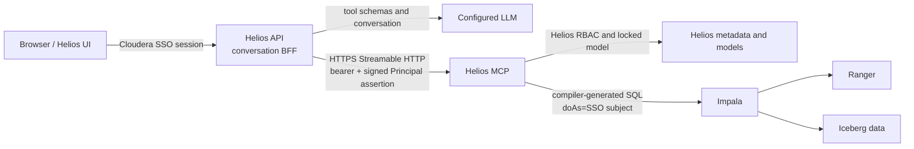

# Talk to Your Data architecture

## Contract and trust boundaries

The Helios UI is an MCP-backed client. It does not query semantic artifacts,
Atlas, Impala, Iceberg, or `helios_core` directly. The authenticated API
Application contains a small conversation backend-for-frontend (BFF), but that
BFF only runs the LLM reasoning loop and invokes tools discovered from the
Helios MCP server.



The browser receives no MCP bearer, delegation secret, Impala credential, or
LLM credential. There is intentionally no UI-only semantic or `/ask` query
implementation.

## Conversation API contract

The model-scoped UI uses these persistent conversation resources:

```text
GET  /api/v1/models/{model_id}/conversations
POST /api/v1/models/{model_id}/conversations
GET  /api/v1/models/{model_id}/conversations/{conversation_id}
POST /api/v1/models/{model_id}/conversations/{conversation_id}/turns
```

Creating a conversation accepts
`{"message":"How many customers are in each region?"}`. Appending a turn also
requires the currently loaded `expected_version`, allowing the API to reject
stale concurrent updates with HTTP 409.

The regular API authentication layer derives the Principal from the
Cloudera-injected `REMOTE-USER` value. The endpoint first requires
`model.read` for the path model. Conversation reads additionally require the
same owning Principal and Model. A successful create/append response contains
the persisted conversation and the current transient turn:

```json
{
  "conversation": {
    "id": "…",
    "model_id": "customer360",
    "title": "How many customers are in each region?",
    "version": 1,
    "messages": [
      {"id": "…", "role": "user", "content": "How many customers…"},
      {"id": "…", "role": "assistant", "content": "The result contains…"}
    ]
  },
  "turn": {
    "model_id": "customer360",
    "answer": "The result contains ...",
    "tool_trace": [],
    "query_result": {
      "columns": ["region", "customer_count"],
      "rows": [["west", 12]],
      "sql": "SELECT ..."
    }
  }
}
```

Only user and assistant text, ownership, title, version, and timestamps are
persisted in SQLite. Query rows, generated SQL, and raw tool results are
transient and are not stored in conversation history. Up to 20 recent
user/assistant messages and 40,000 characters are supplied as bounded LLM
context. The older stateless
`POST /api/v1/models/{model_id}/conversation/turns` endpoint remains available
for diagnostics and compatibility.

`query_result` is null unless `run_query` returned rows. Tool traces omit
secret-like arguments and tool results are size-limited. The endpoint returns
403 before conversation orchestration for an inaccessible model, 404 rather
than exposing another Principal's conversation, 409 for a stale version, and
503 with a safe description when the LLM or MCP service is unavailable.

The React `/talk` page provides conversation history, deep links through the
`conversation` query parameter, a transcript/composer, tabular results, and
collapsed SQL/tool details.

## LLM reasoning loop

The API Application:

1. establishes the already-authorized organization and model context;
2. creates a short-lived Principal assertion;
3. initializes an MCP Streamable HTTP session;
4. discovers the server's current tool schemas;
5. gives those schemas, bounded persisted history, and the user's message to
   the configured LLM;
6. executes requested tools through MCP only;
7. injects the authorized model into every model-aware call, overriding any
   model supplied by the LLM;
8. repeats for at most six tool rounds and returns the final structured turn.
   Repeated identical non-retryable tool failures stop early with the safe
   tool explanation instead of becoming a generic MCP availability error.

The LLM is not an authorization boundary. Prompt text cannot select another
model, and MCP independently reloads grants and authorizes every tool call.
The BFF does not accept arbitrary SQL.

## MCP interface

The MCP Application exposes MCP Python SDK 2.x Streamable HTTP at `/mcp`.
It uses stateless JSON responses. `/healthz` is an operational readiness
endpoint and returns status, version, and model count without model names.

Current tools are:

- `list_models()` — grant-filtered model names and publication states.
- `describe_model(model)` — authorized datasets, fields, metrics, and
  relationships.
- `search_semantics(question, limit, model)` — semantic matches for a natural
  language question.
- `describe(name, model)` — one dataset, field, metric, or glossary term.
- `compile_query(metrics, dimensions, filters, limit, engine, model)` —
  compiler-generated SQL; requires `query.compile`.
- `run_query(metrics, dimensions, filters, limit, model)` — delegated Impala
  execution; requires `query.execute` and physical data authorization.
- `explain_lineage(column, depth, model)` — authorized Atlas lineage; requires
  `datasource.read`.

Semantic tools read published Apache Ossie artifacts through
`helios_core.ossie.SemanticModel`; unpublished proposal fallback artifacts are
converted to the same in-memory representation. Query compilation uses the
shared `helios_core.compiler.Compiler`, not a separate MCP-only SQL path.
Fields resolve by `dataset.field`, physical `database.table.field`, or an
unambiguous physical name, label, or synonym. Filters accept either `column` or
`field` with `op` and `value`.

Success results are JSON objects or arrays in MCP structured content.
Authorization/configuration failures are returned as:

```json
{
  "error": "authorization_denied",
  "message": "the requested model does not match caller context",
  "retryable": false
}
```

Other stable codes include `authentication_required`, `model_not_found`,
`semantic_not_found`, `invalid_semantic_reference`,
`invalid_semantic_query`, `data_authorization_denied`, `query_denied`,
`query_unavailable`, `atlas_unavailable`, and `impala_unavailable`. Transport
authentication errors use HTTP 401; missing server authentication
configuration uses HTTP 503.

## Identity and authorization propagation

The API and MCP Applications share a random secret of at least 32 bytes.
For each turn the API signs an HMAC-SHA256 assertion containing:

- issuer `helios-api` and audience `helios-mcp`;
- issue and expiry timestamps (60-second lifetime);
- a nonce;
- Principal issuer, subject, kind, and display name;
- organization ID;
- locked model ID.

The assertion is sent as `X-Helios-Principal-Assertion` over HTTPS, in addition
to the MCP server bearer credential. MCP verifies the signature, timestamps,
issuer, and audience, reconstructs the Principal, loads current grants from
`HELIOS_METADATA_DB`, and checks the requested action. A model mismatch or an
organization mismatch fails closed.

External agents use the same MCP tools. A server operator may register one
agent identity with `HELIOS_MCP_DEFAULT_PRINCIPAL=issuer:subject`; its client
sends `X-Helios-Model-ID`. That Principal must have normal persisted Helios
grants. There is no anonymous Principal and the shared bearer does not grant
resource access by itself.

## Query execution and Ranger

`run_query` accepts semantic metrics, dimensions, and filters, never raw SQL.
MCP compiles the request, resolves every physical dataset against the selected
model's DataSource references, checks `query.execute`, and caps the result at
1,000 rows. Physical authorization uses each Ossie dataset's `source`
(`database.table`), including every joined dataset.

Execution remains disabled unless `IMPALA_PROXY_DELEGATION=true`. When enabled,
the Impala adapter:

1. connects with the configured Helios service/proxy account;
2. appends URL-encoded `doAs=<Principal.subject>` to the HTTP path;
3. executes `SELECT EFFECTIVE_USER()` before user SQL;
4. rejects the request if the returned identity differs;
5. executes compiler-generated SQL and lets Ranger apply that effective user's
   table permissions, row filters, and column masking.

The target Impala Virtual Warehouse must explicitly permit the Helios service
account to proxy the relevant SSO users. A live verification of `doAs`,
`EFFECTIVE_USER()`, and Ranger denial is a deployment gate. If the platform
does not support this behavior, leave proxy delegation disabled; semantic
discovery and compilation can still work, but data execution fails closed.

## Required configuration

Helios API Application:

```text
HELIOS_MCP_URL=https://<helios-mcp-application>/mcp
HELIOS_MCP_TOKEN=<random server credential>
HELIOS_MCP_DELEGATION_SECRET=<random value of at least 32 bytes>
MISTRAL_API_KEY=<secret>
```

When `MISTRAL_API_KEY` is present and `LLM_PROVIDER` is unset, Helios uses
Mistral's OpenAI-compatible `https://api.mistral.ai/v1` endpoint with
`mistral-small-latest`. `MISTRAL_MODEL` and `MISTRAL_BASE_URL` may override
those defaults. The key remains only in the API Application environment.

Anthropic remains available through `LLM_PROVIDER=anthropic`,
`ANTHROPIC_API_KEY`, and `ANTHROPIC_MODEL`. For an OpenAI-compatible Cloudera
AI Inference endpoint, use
`LLM_PROVIDER=openai`, `INFERENCE_BASE_URL`, `INFERENCE_MODEL`, and optionally
`INFERENCE_API_KEY` instead.

Helios MCP Application:

```text
HELIOS_MCP_TOKEN=<same server credential>
HELIOS_MCP_DELEGATION_SECRET=<same delegation secret>
HELIOS_MCP_ALLOWED_HOSTS=<MCP Application public hostname>
HELIOS_METADATA_DB=<shared persistent metadata database, if nondefault>
IMPALA_HOST=<Virtual Warehouse JDBC host or URL>
WORKLOAD_USER=<approved proxy/service account>
WORKLOAD_PASSWORD=<workload password>
IMPALA_PROXY_DELEGATION=true
```

The MCP Application also needs the same persistent project model/run paths as
the API. `HELIOS_MCP_DEFAULT_PRINCIPAL` is optional and is only for a
registered external agent.

The UI Application receives no new secret. It retains only
`HELIOS_API_URL`, and browser requests continue to use the user's Cloudera SSO
session.

## Verification and failure behavior

Automated tests cover assertion tampering/expiry, MCP bearer and assertion
rejection, a real in-process Streamable HTTP MCP session, model locking,
per-tool RBAC, deterministic LLM tool selection, API Principal propagation,
Impala `doAs`, effective-user mismatch, and delegated query results.

Production validation must additionally prove:

1. API-to-MCP HTTPS connectivity through stable Application URLs;
2. an authorized user can search and compile only their selected model;
3. an unauthorized model and dataset are denied;
4. `EFFECTIVE_USER()` equals the Cloudera SSO subject;
5. a known Ranger denial, row filter, and column mask remain effective;
6. no bearer, delegation secret, LLM key, or Impala credential appears in
   browser assets, API responses, or logs.

