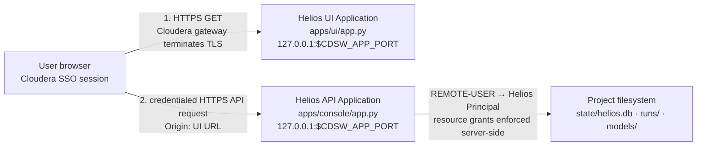

# Helios API and UI deployment on Cloudera AI

This is the deployment runbook for two authenticated Applications in one
Cloudera AI Project:



The UI serves static React assets. It does not proxy API requests. The browser
calls the API Application's stable HTTPS URL directly, using its existing
Cloudera SSO session. Do not use an Application container IP or an internal
engine URL as persistent configuration.

## Platform prerequisites

- Both Applications are in the same Cloudera AI Project.
- Users have at least read access to that Project plus the required Helios
  resource grants.
- Authentication remains enabled for both Applications. Do not select
  **Enable Unauthenticated Access**.
- The Cloudera AI release must support authenticated, cross-origin
  inter-Application requests and unauthenticated `OPTIONS` preflights. For
  Cloudera AI on premises, the CORS regression described by DSE-56081 is fixed
  in 1.5.5 SP2 CHF1. Validate the behavior on the actual target release before
  production use.
- The public Application endpoints use HTTPS with a certificate trusted by
  users' browsers.

Do not enable Cloudera's global wildcard CORS setting as a substitute for the
Application policy. Credentialed Helios requests require the API to return one
exact UI origin together with `Access-Control-Allow-Credentials: true`.

References:

- [Securing Applications](https://docs.cloudera.com/machine-learning/cloud/applications/topics/ml-securing-applications.html)
- [Installing additional runtime packages](https://docs.cloudera.com/machine-learning/cloud/runtimes/topics/ml-install-pkg-lib-runtimes.html)
- [DSE-56081 fix](https://docs.cloudera.com/machine-learning/1.5.5/release-notes-privatecloud/topics/ml-fixed-issues-cloudera-ai-1-5-5-sp2-chf1.html)

## Runtime decision

A custom Cloudera AI Runtime is **not required** for either Application.

- The UI production server uses only the Python 3 standard library. Node.js is
  a build-time tool and is not needed by the running UI Application.
- The API's current FastAPI, SQLite, LDAP-over-HTTPS Impala, Atlas, and Ossie
  dependencies install into a project-local directory from Python wheels or
  pure-Python packages on PBJ Python 3.12. A dependency resolution dry run
  does not require a system package installation.
- The root packages in `runtime/Dockerfile` are for possible future
  SASL/GSSAPI/Kerberos support and are not used by the current LDAP/HTTPS
  Impala connection.
- The cloned `/opt/ossie` tree in that image is not read by the current
  Application code; the required schema is in `helios_core/ossie`.

The existing custom runtime can still be selected for discovery jobs or an
environment that has standardized on it. It becomes justified for these
Applications only if a real deployment adopts Kerberos/GSSAPI or another
dependency that requires unavailable system libraries. Reproducibility alone
is handled here with a pinned API requirements file and `package-lock.json`.

Use the same PBJ Python 3.12 runtime version for dependency installation and
for the API Application. Reinstall the project-local dependencies after
changing that Python runtime version.

## One-time project preparation

Run these commands in a PBJ Python 3.12 Workbench session in the Project. Do
not install dependencies in an Application's startup path; startup should not
depend on package-registry availability.

### API dependencies

```bash
cd "$CDSW_PROJECT_DIR"
python3 -m pip install --upgrade \
  --target "$CDSW_PROJECT_DIR/.helios-python" \
  -r helios/apps/console/requirements.lock
```

`apps/console/app.py` automatically adds `.helios-python` to the child API
process. Set `HELIOS_PYTHON_DEPS` only when a different project-persistent
directory is deliberately used.

### UI build

Use Node.js 20 or newer in a preparation session or CI runner:

```bash
cd "$CDSW_PROJECT_DIR/helios/apps/ui"
npm ci
npm run typecheck
HELIOS_UI_BUILD_NUMBER="$(git rev-parse --short HEAD)" npm run build
test -f dist/index.html
```

`npm ci` consumes the committed lock file. `apps/ui/dist` is intentionally
ignored by Git, so every fresh Project checkout must build or receive this
artifact before the UI Application starts. A normal Application restart does
not rebuild it.

## 1. Create the Helios API Application

Create an authenticated Cloudera AI Application with:

- **Name:** `Helios API`
- **Script:** `helios/apps/console/app.py`
- **Runtime:** the same standard PBJ Workbench Python 3.12 runtime used for
  dependency installation
- **Subdomain:** a stable value such as `helios-api`
- **Unauthenticated access:** disabled

Cloudera injects `CDSW_APP_PORT`; do not define or hard-code it. The launcher
starts Uvicorn on `127.0.0.1:$CDSW_APP_PORT`, which is the loopback endpoint
expected by the Cloudera Application gateway. Uvicorn access and application
logs are written to stdout/stderr and appear in the Application logs.

Start the API once and copy its exact public HTTPS origin, for example:

```text
https://helios-api.<workbench-domain>
```

Do not include a path or trailing slash in configuration.

### API environment variables

Set these on the API Application:

| Variable | Required | Value |
| --- | --- | --- |
| `HELIOS_UI_ORIGINS` | Yes after UI creation | Exact UI HTTPS origin. Multiple exact origins may be comma-separated. Never `*`. |
| `HELIOS_ROOT` | Only for a nonstandard checkout | Defaults to `$CDSW_PROJECT_DIR/helios`. |
| `HELIOS_PYTHON_DEPS` | Only for a nonstandard dependency location | Defaults to `$CDSW_PROJECT_DIR/.helios-python`. |
| `HELIOS_METADATA_DB` | Usually leave unset | The default is the persistent `<project>/helios/state/helios.db`; otherwise enter a fully expanded absolute path. |
| `HELIOS_RUNS_DIR` | Optional | Defaults to `$HELIOS_ROOT/runs`. |
| `HELIOS_AUDIT_RETENTION_DAYS` | Optional | Product-visible audit retention, from 1 through 3650 days. Defaults to 30. |

The following are feature-specific rather than required for API readiness:

- `ATLAS_BASE`, `ATLAS_USER`, `ATLAS_PASS`
- `IMPALA_HOST`, `IMPALA_PORT`, `IMPALA_DATABASE`,
  `IMPALA_HTTP_PATH`, `WORKLOAD_USER`, `WORKLOAD_PASSWORD`
- `MISTRAL_API_KEY` for Talk to Your Data; Helios defaults to
  `mistral-small-latest` at `https://api.mistral.ai/v1`. Optional overrides are
  `MISTRAL_MODEL` and `MISTRAL_BASE_URL`.
- `INFERENCE_BASE_URL`, `INFERENCE_MODEL`, `INFERENCE_API_KEY`

Store credentials through the Cloudera environment-variable/secret mechanism,
not in source control. Leave TLS verification enabled. In particular, do not
set `ATLAS_VERIFY_SSL=false`.

Do **not** set `HELIOS_DEV` or `HELIOS_DEV_USER` on the deployed Application.
Those variables are local-development identity fallbacks.

### API readiness

After startup:

```text
GET https://helios-api.<workbench-domain>/api/v1/healthz
-> {"status":"ok"}
```

The endpoint proves that imports, metadata-directory creation, SQLite
migrations, and route startup succeeded. It intentionally does not make Atlas,
Impala, or inference calls. The legacy console root page performs those deeper
optional checks.

## 2. Create the Helios UI Application

Confirm `apps/ui/dist/index.html` exists, then create a second authenticated
Application:

- **Name:** `Helios UI`
- **Script:** `helios/apps/ui/app.py`
- **Runtime:** a standard PBJ Workbench Python 3.12 runtime
- **Subdomain:** a stable value such as `helios-ui`
- **Unauthenticated access:** disabled

Set:

| Variable | Required | Value |
| --- | --- | --- |
| `HELIOS_API_URL` | Yes | Exact public HTTPS origin copied from the API Application. |
| `HELIOS_ROOT` | Only for a nonstandard checkout | Defaults to `$CDSW_PROJECT_DIR/helios`. |

Do not set `VITE_HELIOS_API_URL` in Cloudera. That variable is only a
development-server/build fallback. Production reads `HELIOS_API_URL` at
runtime from the UI server's non-cached `/config.js`.

The UI server binds to `127.0.0.1:$CDSW_APP_PORT`, logs requests to the
Application log, serves hashed Vite assets, and returns `index.html` for
unknown non-file paths. Browser refreshes and deep links such as
`/canvas?organization=<id>&model=<id>` therefore work.

Its readiness endpoint is:

```text
GET https://helios-ui.<workbench-domain>/healthz
-> ok
```

The process fails fast, before opening the port, if `HELIOS_API_URL` is invalid
or `dist/index.html` is missing.

## Complete cross-Application configuration

After the UI Application has a public URL:

1. Copy its exact origin.
2. Set that value as `HELIOS_UI_ORIGINS` on the API Application.
3. Restart the API Application so CORS middleware is rebuilt from the new
   environment.
4. Restart the UI only if `HELIOS_API_URL` changed. A frontend rebuild is not
   required for an API URL change.

The browser request is:

```text
Origin: https://helios-ui.<workbench-domain>
Cookie: <browser-managed Cloudera SSO session>
GET/POST https://helios-api.<workbench-domain>/api/v1/...
```

The frontend uses `credentials: "include"` and never sends `REMOTE-USER`.
Cloudera's gateway authenticates the request and injects trusted
`REMOTE-USER`; FastAPI converts it to
`cloudera-workbench:<username>`. Helios then loads that principal's persisted
resource grants and enforces authorization on every API and graph request.
Browser-side action visibility is only presentation; the API remains
authoritative.

## Verification after deployment

Use an authenticated browser and its developer tools:

1. Open the UI URL. Confirm the shell's build number matches the intended
   build.
2. Open `<UI origin>/config.js`. Confirm it contains only the expected API
   HTTPS origin.
3. Confirm `<API origin>/api/v1/healthz` returns JSON.
4. Confirm `<API origin>/api/v1/diagnostics` reports the signed-in Cloudera
   username rather than an Application service identity.
5. Confirm the diagnostics response reports the expected accessible
   organization count.
6. Inspect an API response and verify:
   - `Access-Control-Allow-Origin` exactly equals the UI origin;
   - `Access-Control-Allow-Credentials` is `true`;
   - TLS is valid; and
   - mutating review requests complete their `OPTIONS` preflight and `POST`.
7. Refresh a Canvas deep link directly.
8. Restart each Application separately and repeat health, diagnostics, and
   deep-link checks.

If transparent identity is absent, the preflight is rejected, or the gateway
returns wildcard CORS for credentialed requests, stop. Do not work around it
with disabled authentication, a UI service identity, a transient container
address, or disabled TLS verification.

## Logs and audit records

API, UI, MCP, and Job process output continues to stdout/stderr and is available
in the corresponding Cloudera AI Application or Job logs. This includes startup
failures and a warning if a persistent audit write fails.

Product activity is stored separately in the persistent metadata database
(`state/helios.db` by default) and appears under **Activity Logs** in the Helios
UI. Users see only their own sessions. Organization administrators can opt into
organization-wide activity for organizations where they have
`organization.manage`. Audit records are redacted and do not contain
credentials, prompts, answers, SQL text, query results, or HTTP bodies.
Unexpected server failures may include a sanitized exception chain and stack
location in the persisted event. Those diagnostics are returned only to an
administrator with `organization.manage` for the event's organization. Known
runtime secrets and generated SQL are removed before persistence. The MCP
Application log receives the full server traceback with the same request ID
for restricted operational troubleshooting.

The UI sends an opaque `X-Helios-Session-ID` correlation header; it is not a
credential. `HELIOS_UI_ORIGINS` remains an exact-origin allowlist, and the API
CORS configuration permits this header for credentialed browser calls.

## Failure and restart behavior

- API startup is idempotent: SQLite migrations run on each process start.
- Audit retention cleanup runs at process initialization. API startup creates
  the audit schema automatically through the same append-only migration path.
- Application containers are replaceable. Durable metadata, run artifacts,
  the built UI, and project-local dependencies must remain on the Project
  filesystem, not in container-only locations.
- If Uvicorn exits, `apps/console/app.py` exits with the same status so
  Cloudera records a failed Application rather than a false healthy state.
- API network, authentication, authorization, and non-JSON login responses
  are classified in the UI as API unavailable, authentication failure, or
  authorization failure. Review mutations are not applied optimistically.
- Changing API or UI environment variables requires an Application restart.
- Changing frontend source requires `npm ci`/`npm run build` followed by a UI
  restart. Hashed assets prevent old JavaScript from being mistaken for the
  new build.

## Remaining deployment risks

1. Cross-origin SSO and `OPTIONS` behavior depends on the deployed Cloudera AI
   release and gateway configuration; repository tests cannot reproduce that
   gateway.
2. `apps/ui/dist` is not committed. A fresh checkout is undeployable until the
   build step succeeds or CI supplies the artifact.
3. SQLite is suitable for one API Application process on the shared Project
   filesystem, not horizontally replicated API instances or high write
   concurrency.
4. `/api/v1/healthz` is process readiness, not a deep Atlas/Impala/inference
   health check.
5. Recreating either Application can change its public origin. Update the
   opposite Application's configuration and restart it.
6. The project-local Python dependency directory is tied to Python 3.12 and
   the selected runtime ABI. Reinstall it when the runtime changes.
7. A gateway login redirect can appear to browser `fetch` as a CORS/network
   failure rather than a readable 401. The UI will remain safe but may report
   API unavailable instead of authentication failure; verify behavior on the
   target release.
8. The API retains `x-forwarded-user` as a legacy identity fallback.
   Production depends on the Cloudera gateway preventing callers from
   injecting trusted identity headers; browser CORS does not allow this header.
